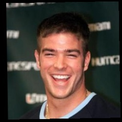
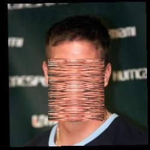
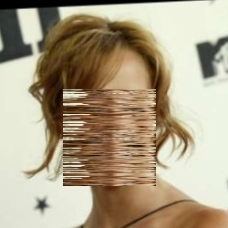

# Key-Based Image Shuffler

KB-Image-Shuffler has been a little project aimed at a proposing a way to protect facial data sent through an insecure network by enabling a chance of recovery from the so called “Sniff-and-Suppress” attacks. At its core, this program can be used to scramble or unscramble an image using a user-provided key. It can also encode information about facial images to a file and can perform face recognition on any facial image provided the encodings file.

## Table of Contents
* [Problem](#problem)
* [Explored Solution](#explored-solution)
* [Installation](#installation)
* [Usage](#usage)
* [Examples](#examples)
* [Resources](#resources)

## Problem

Biometric data used for user authentication can be susceptible to sniff-and-suppress attacks, given an insecure network. A workaround to this problem would be to use passwords for authentication, instead of biometric data. However, authentication using an alphanumeric password has one major drawback: there is no one-to-one relationship between a password and its owner. A user can have multiple passwords and a password can be used by multiple users. If this downside is nonnegotiable, authentication systems will have to resort to biometric-based authentication.

Biometric data used for user authentication is not without its setbacks. Due to the nature of the data, there is always an expectation of failure; a user attempts to access their device using a fingerprint scanner, and maybe they placed their finger on the scanner slightly off, enough so that the system failed to authenticate the user. This is of no surprise to the user, who then proceeds to place their finger on the scanner once again to reattempt authentication, only this time, the system managed to authenticate the user and grants access to the device.

This aspect of biometric data renders them particularly vulnerable to a form of replay attacks called “sniff and suppress”. A malicious actor begins such an attack by sniffing the incoming packets to a destination, such as a server for verifying biometric data. When a user sends a fingerprint or a picture of their face to this server, the attacker suppresses that packet and intercepts the information. From the user’s perspective, it would appear as though the request for authentication was denied. The user would usually recall the expectation of failure and proceed to reattempt authentication, oblivious to the fact that now a malicious attack has possession of their personal information. From the viewpoint of the server, it would seem as though the first attempt at authentication never happened, given that the attempt was suppressed and intercepted.

Unlike passwords, which when intercepted, can be changed, and reestablish protection against unauthorized access, biometric data is unique to a user, and once it falls into the wrong hands, little can be done to prevent malicious actors from accessing accounts protected by the biometric data.

## Explored Solution

Work has been put into finding ways of protecting fingerprint data from sniff-and-suppress attacks. These methods have consisted of performing alterations on a given fingerprint, denoted by a provider user key, prior to sending the data through an insecure network. Then, if this data is intercepted, it would contain the altered version of the fingerprint. This altered version of a given fingerprint would be unrecognizable by the verification server, and thus, would not provide any successful authentication to any associated user account, rendering the intercepted data without useful purpose. This way, a recovery from a sniff-and-suppress attack or any sort of replay attacks can be made possible.

On the other hand, achieving the same goals with face recognition has proven to be difficult. Key-based Image Shuffler employs a method that mimics alterations done to a fingerprint to perform alterations to an image of a face. The pixels of a facial image that happen to contain or be near the landmarks of the face are scrambled, using a user-provided sequence of positive integers. Once scrambled, the image can be unscrambled back to its original form using the same key and providing the dimensions of the landmarks yielded by the scrambling. This way, a perhaps straightforward method of enabling recovery from a sniff-and-suppress attack using facial image data can be provided by this project.

## Installation

`imageshuffle.py` is a command-line-style python script. It can be run without needing to preface it with `python3`. You can use it from anywhere inside the terminal by adding it to your PATH, as long as you install the required Python libraries from the `requirements.txt` file.

See [INSTALL.md](INSTALL.md) for a more detailed explanation on how to install the program.

## Usage

### `imageshuffle.py`

`imageshuffle.py` is the main script file. It requires a subcommand upon running. The following subcommands are available:
* `scramble`
* `unscramble`
* `recognize`
* `encode`

### `scramble`

The `scramble` subcommand effectively scrambles an image, given the path to an image file and a key. It takes the following options:
* `image` - path to image file
* `key` - a sequence of positive integers between 1 and 200 (inclusive). It must have at least 10 terms and at most 100 terms
* `-o OUTPUTDIR`, `--output OUTPUTDIR` - path to directory where to store generated files. By default, generated files are stored in the same directory as the image file

Once the image is scrambled using the key, the program will save the scrambled image to a new file and will also save to another file the dimensions of the general location of the landmarks. This landmarks file is also needed to unscramble the associated image.

### `unscramble`

The `unscramble` subcommand unscrambles an image. It applies the scrambling algorithm in reverse, undoing what was previously done on the image. It takes the following options:
* `image` - path to image file`
* `key` - a sequence of positive integers between 1 and 200 (inclusive). It must have at least 10 terms and at most 100 terms
* `lm_top` - the upmost y-coordinate of landmarks of facial image
* `lm_bottom` - the bottommost y-coordinate of landmarks of facial image
* `lm_left` - the leftmost x-coordinate of landmarks of facial image
* `lm_right` - the rightmost x-coordinate of landmarks of facial image
* `-o OUTPUTDIR`, `--output OUTPUTDIR` - path to directory where to store generated files. By default, generated files are stored in the same directory as the image file

Using the `scramble` subcommand will result in two files being generated: the scrambled image file and the landmarks file that contains the dimensions of the region that contains the landmarks. One can simply con**cat**enate this landmarks file and pass the result as argument, right after the `key` argument. To perform a successful unscrambling of the image, the same key that was used for scrambling must be used for the unscrambling as well.

### `recognize`

The `recognize` subcommand performs face recognition on an input image. It takes the following options:
* `image` - path to image file
* `encodings` - path to encodings file

The encoding file is a file that stores the encoding of sample facial images that have been provided. Ideally, images about a user or a set of users would be encoded to a file, and then this file is provided to the `recognize` subcommand, along with the new image of a user whose information has been encoded. Then, the script will attempt to determine, given this new facial image, to what user it belongs.

### `encode`

The `encode` subcommand encodes facial characteristics from images that belong to a user or a set of users. It takes the following options:
* `dataset` - path to directory containing target images. It can either be a directory that contains images of one user, or a directory of subdirectories, each subdirectory containing image respective to a single and unique user
* `encodings` - path to encodings file. If the file does not exist, it will create a new one and store the encodings in it. It the path specified points to an existing encoding file, it will read its data and update information about existing users, or append new users to the file, depending on the provided images

## Examples

Original             |  Altered
:-------------------------:|:-------------------------:
  |  
 | 

## Resources
* [Key-based scrambling for secure image communication](https://citeseerx.ist.psu.edu/viewdoc/download?doi=10.1.1.995.8895&rep=rep1&type=pdf)
* [Face recognition with OpenCV, Python, and deep learning](https://www.pyimagesearch.com/2018/06/18/face-recognition-with-opencv-python-and-deep-learning/)
* [OpenCV Face Recognition](https://www.pyimagesearch.com/2018/09/24/opencv-face-recognition/)
